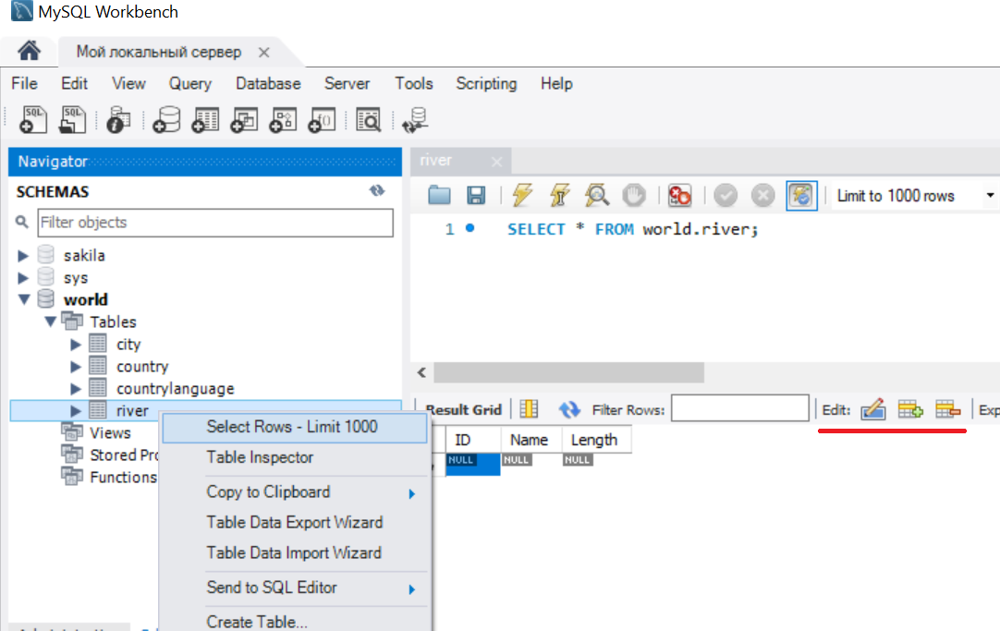

# Введение в работу с базами данных

## Предварительные шаги

1. Изучите теоретическую часть

2. Установите MySQL Server и MySQL Workbench ([инструкция](https://youtu.be/sKEBq3RH0xs))

3. Запустите MySQL Workbench, подключитесь к серверу

## Ход работы

1. На панели `Navigator` найдите базу данных (схему) `world` и разверните дерево так, чтобы были видны её таблицы
   

2. Откройте контекстное меню на пункте `Tables` и новую таблицу `river` со следующими колонками:

   * `ID`, выберите тип данных INT, проставьте галочки: Primary Key, Not Null, Unique, Auto Increment
   * `Name`, выберите тип данных VARCHAR(50), проставьте галочку Not Null
   * `Length`, выберите тип данных INT

   Примените изменения (кнопка `Apply`)

   

3. Откройте контекстное меню на созданной таблице `river`, выберите пункт `Select Rows - Limit 1000`, используйте кнопки редактирования в разделе просмотра данных для ввода данных о 5 реках.

   

4. Откройте контекстное меню на таблице `city`, выберите пункт `Alter Table...`, добавьте новую колонку:

   * `River`, выберите тип данных INT

   Также добавьте новый внешний ключ (Foreign Key):

   * Foreign Key Name: `city_river`
   * Referenced Table: `world.river`
   * Column: `River`
   * Referenced Column: `ID`
   * On Delete: `SET NULL`

   

5. Удалите таблицу `countylanguage`

6. Экспортируйте данные с помощью пункта меню `Server`, `Data Export`, скопируйте файлы резервной копии в каталог с данным репозиторием.
7. Откройте app.py, исправьте пароль в функции `get_data()`.  Проверить работу веб-сайта и сделать скриншот
8. Сделать коммит и отправить его на GitHub для проверки

## Проверка работы веб-сайта

```
py -m venv venv
venv\scripts\activate.bat
pip install mysql-connector-python
```
